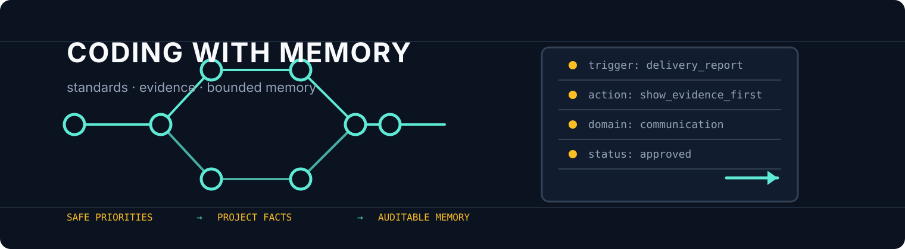
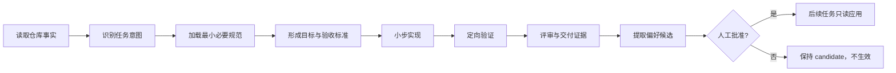

<div align="center">

# Coding with Memory

<p>
  
</p>

> 让 Agent 写得更清楚，让项目记得更克制。

[](https://agentskills.io)
[](https://openai.com/codex/)
[](https://google.github.io/styleguide/)
[](LICENSE)

**Coding with Memory** 是一个面向 Agent 编程团队的工程化 Skill：把需求路由、代码规范、中文注释、质量门禁、系统化调试、代码评审和可审计的用户偏好 Memory 组织成一条可执行的开发工作流。

</div>

---

## 它解决什么问题

直接让 AI 写代码，常见结果是分支越来越多、抽象越来越深、注释越来越像代码翻译，最后没人能说清楚“为什么这样写”。这个 Skill 把 Agent 的自由度放在正确的位置：

| 层次 | 负责内容 | 是否允许 Memory 改变 |
| --- | --- | --- |
| 安全与项目规则 | 合规、架构边界、仓库约束 | 不允许 |
| 代码标准 | Google 风格、语言规范、错误处理 | 不允许 |
| 质量门禁 | 测试、Lint、类型检查、审计 | 不允许 |
| 用户偏好 | 沟通语言、计划粒度、报告格式 | 只影响表达 |

核心原则：**Memory 是有证据、可撤销的未来工作建议，不是第二套代码标准。**

## 快速开始

### 安装到 Codex / Claude Code / Cursor

使用兼容 Agent Skills 的安装器：

```bash
npx skills add SunPlough/Coding-with-Memory
```

也可以直接把本仓库复制到对应 runtime 的 `skills/` 目录。Codex 用户通常放在：

```text
~/.codex/skills/coding-with-memory/
```

### 调用示例

```text
用 Coding with Memory 实现一个用户登录功能，先给出验收标准和风险，再开始改代码。
```

```text
用 Coding with Memory 审查这个 PR，按严重性列出问题，并区分已验证和未运行的检查。
```

```text
用 Coding with Memory 调试这个失败测试，先复现并定位根因，不要直接猜修复方案。
```

## 工作原理



任务路由分为 `discover`、`specify`、`plan`、`implement`、`debug`、`review`、`ship` 和 `evolve`。路由只决定工作流，不改变安全、项目规则和质量标准的优先级。

## 代码规范

规范按语言隔离，避免把 JavaScript、Python、Go 和 C++ 的习惯混成一套模糊规则。当前目录包含 Google 风格来源索引和按语言拆分的参考文件：

| 语言/领域 | 参考入口 |
| --- | --- |
| 通用工程基线 | `references/coding-standards/base.md` |
| 规范索引与语言映射 | `references/coding-standards/index.md`、`language-map.yaml` |
| Python | `references/coding-standards/languages/python.md` |
| Java / Kotlin / Go / Rust | `references/coding-standards/languages/` |
| JavaScript / TypeScript | `references/coding-standards/languages/` |
| C / C++ / C# | `references/coding-standards/languages/` |
| 中文代码注释 | `references/coding-standards/comments/` |

注释只解释代码本身无法稳定表达的契约、约束、边界和设计原因。禁止逐行翻译代码、注释掉旧代码、虚构 Issue 或把用户偏好当成仓库规范。

严格模式会先校验 `references/coding-standards/upstream-manifest.json`，再加载当前语言对应的 Google 官方正文快照。快照固定在 `google/styleguide` 的提交 `1809c769de31ba388c755ad15dd057a9ba8531fd`，共 43 个正文/工具配置文件；可用以下命令复核：

```bash
python scripts/verify_upstream.py --skill .
```

Rust、Dart、Swift、Kotlin 等不属于该主仓库的语言会明确标记为 `external-source`，不能冒充 Google 主仓库规范。

## Memory 设计

运行时 Memory 写入目标项目的 `.coding-memory/`，不会写入 Skill 安装目录。

```text
trace -> classify -> redact/deduplicate -> candidate
candidate -> approved | rejected | deprecated
approved -> deprecated
```

Memory 条目采用原子字段：

```text
trigger: 什么时候适用
action: Agent 应采取的低风险动作
domain: communication | planning | tool | delivery | pattern | incident
```

自动提取只能创建 `candidate`。用户偏好必须由人明确批准；工程决策、可复用模式和事故单独分类，不能伪装成偏好。批准后的偏好仍然不能改变代码规范、测试范围、安全要求、架构边界或质量门禁。

初始化与审查：

```bash
python scripts/memory_tool.py --repo <project> init
python scripts/memory_tool.py --repo <project> list --category preference
python scripts/memory_tool.py --repo <project> index
```

## 质量与交付

每次交付都要留下可复核的证据包：

- 目标、非目标和变更路径；
- 实际运行的命令、退出码和观察结果；
- `passed`、`failed`、`skipped`、`not-found` 的明确区分；
- 已知风险和回滚方法；
- 本次应用或提出的 Memory，以及它对行为的影响范围。

常用检查脚本：

```bash
python scripts/collect_context.py --repo <project> --format markdown
python scripts/run_quality_gate.py --repo <project> --format markdown
python scripts/comment_audit.py --repo <project> --format markdown
python scripts/skill_health.py --skill . --format markdown
```

## 示例

`examples/langgraph_agent_demo.py` 是一个 500 行以上的离线 LangGraph Agent，用来观察本 Skill 约束下的代码和注释效果。它展示：

- 显式 `TypedDict` 状态契约；
- `intake → planning → execution → review → revision → finalize` 图结构；
- 有上限的评审修订回路；
- approved/candidate Memory 隔离；
- 中文契约注释与确定性自检。

运行：

```bash
python examples/langgraph_agent_demo.py --self-test
python examples/langgraph_agent_demo.py --task "为项目增加用户登录功能"
```

示例不调用外部 LLM，不需要 API Key；运行真实项目时仍应使用项目自己的测试、Lint、类型检查和安全门禁。

## 仓库结构

```text
Coding-with-Memory/
├── SKILL.md                         # Agent 入口与核心工作流
├── agents/openai.yaml               # Codex UI 元数据
├── references/                      # 按意图、语言、框架和风险渐进加载
├── scripts/                         # 上下文、门禁、注释审计、Memory 工具
├── assets/project-config/            # 可复制的项目门禁配置样例
├── assets/evolution/                # Skill 演化测试提示词
└── examples/                        # 可运行示例，不参与默认触发
```

## 诚实边界

- Skill 不会替代仓库事实；没有配置或测试时，只能报告 `not-found`。
- Memory 不会自动晋级为工程标准，也不会静默改变后续代码行为。
- 自动提取只保存最小结论和证据引用，不保存完整对话、源码、凭据或个人数据。
- 质量脚本提供确定性检查，但最终仍需要人审查 diff、风险和业务正确性。
- “自进化”是 validation-gated：先保留基线和回归提示词，验证失败就回滚，不追求无证据的自动改写。

## 参与贡献

欢迎提交与以下方向有关的 Issue 或 Pull Request：

- 新语言的权威规范索引；
- 中文注释误报或漏报案例；
- Memory 脱敏、去重、审批和回放改进；
- 可复现的质量门禁适配；
- 不增加无用途抽象的工作流改进。

贡献内容应附带：问题背景、适用范围、验证命令、已知风险和回滚方式。强制规范的修改不能只凭个人偏好提交。

## 许可证

[MIT License](LICENSE)

<div align="center">

**写代码时保留判断，记忆时保留边界。**

</div>
